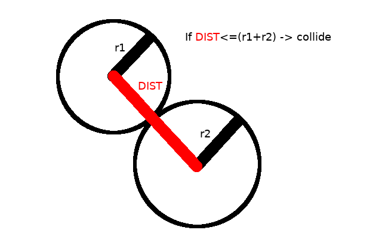
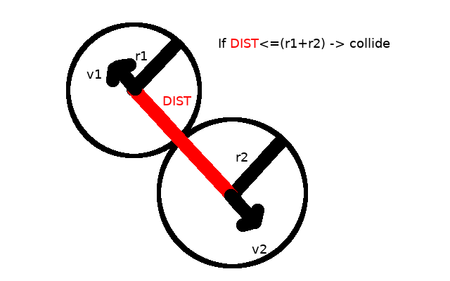
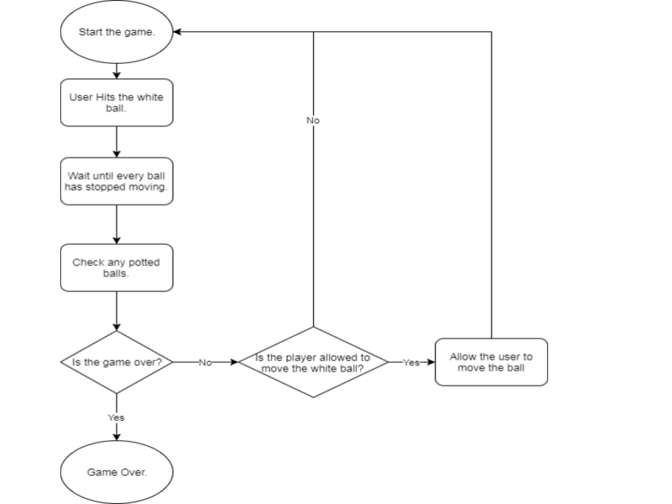

# Analysis

## Description of Current System:
Most pool game are hosted on flash game websites like miniclip.com, and others, unfortunately these websites do not provide you with game files, and you have to play the game in your browser. This is bad not only because that does not allow for any customisation for the game files if the user wants to do so, but also players dont know how the physics of the game works, for example the players dont know the friction coefficients between the balls and the table which means that the game experience could deviate from the one the players used to in real life.

## Identification of End Users:
The primary use for this project is for pool game enthusiasts who want the ability to customise their experience to their needs. The casual pool game players will enjoy the game as well, but these people already have a lot of options available to them online.

## User Needs:
Make the constumisable options of the game like the friction coefficients easily accesible in the config file, so that even people without coding experience could adjust the values.
The game should be open source so that people who are interested in the inner workings of the game could analyse it.

## Acceptable Limitations:
The purpose of the game is to provide a highly customisable experience, and thus the actual graphics of the game might be less appealing than other games online.

## Data Sources and Destinations:

## Object Analysis Diagram:

## Data Flow Diagram:

## Proposed Solution:

## Evidence of Analysis:
Physics behind the simulation
The game will have to resolve elastic ball collisions and other physical processes. The balls will be modeled To understand the maths behind the collisions I will mainly use my knowledge from maths Mechanics 1 and 2 modules but I will also research the topic online. (<https://www.gamasutra.com/view/feature/131424/pool_hall_lessons_fast_accurate_.php> and <https://en.wikipedia.org/wiki/Elastic_collision> )

## Similar games currently available
I’ve studied some pool games online to get an idea what features I could add to my program, which are missing from the majority of games available online. The main problems with pool games online are:
There is a plethora of games which are closed source, but it’s hard to find the source code online. By making the game open-source the users will gain the ability to study the inner- workings of the game. The code of the game can be used to study other things besides computers and code, for instance my game could be used to simulate famous Newtons cradle experiment, by removing friction.
The games cannot be edited/configured. By limiting the ability of changing the inner- workings of the game the user might not get the experience he wants, for example the user might want to practise a specific kind of shot, do trick shots or change the size and the colour of the balls. By making an open-source game the user can change everything!

## Objectives

## Critical Path
Research the physics behind the collisions and decide which python modules would be useful for the game

# Documented design

## Overall System Design:

## Modular Design:

## Data Validation:

## Algorithms:

### Collision detection

One way detect a ball to ball collision is to check every frame the distances between every ball and, if the distance between two balls is less that the sum of their radii, that means that they have collided.



Unfortunately, such a strategy sometimes makes the balls "stick" to each other. That is because this strategy doesn't take into consideration the direction the balls are going. For example, in the previous picture, if the balls are going in the opposite directions, the balls shouldn't collide because if they do, they are going to be moving towards each other after the collision, which isn't right.



We have to consider the directions of the balls velocities to detect collisions accurately. To do that we will take the dot product 

* Collision resolve

* Cue stick click detection

* Generating the table


## User Interface:

## Design Explained Through Detailed Run Through of the Program with an Example

## Database:

## Proposal
The game will touch on several computer science areas. The program will implement classes for better code readability and maybe even some of the harder OOP ideas like overloading. The program will store the information about the state of the game, which will mostly consist of the coordinates and the velocity of the pool balls on the table. There will be 3 types of collision - ball to ball, ball to table side and ball to table hole. Every frame the game will check for these collisions, and if it detects any, it will resolve the collision based on the velocity and the position of the balls using linear algebra and vector operations.
The game would be written in python and some additional libraries:

* Pygame
* Numpy
* Zope.Event

### Pygame
Python has a library called turtle[2] that is part of the standard python installation, however it’s mainly for education purposes and does not nearly have the functionality for making a pool game. Here is an except from the pygame website[1]
Pygame (the library) is a Free and Open Source python programming language library for making multimedia applications like games built on top of the excellent SDL library. Like SDL, pygame is highly portable and runs on nearly every platform and operating system.

### Numpy
Numpy is a powerful tool for numerical calculations often involving matrices. In this project matrices are used for drawing the ball sprites, specifically 3d rotation matrices.

## Design  considerations
Judging from other computer games, the pool game should include these things:

* The game screen should be big enough to see everything clearly.
* The balls should look realistic, and have easily distinguishable stripes on them so the players wouldn’t be confused which balls they need to pot.
* The game should have aiming lines to help the player aim. These lines are needed because in real life the player can line up the ball and see where it will go, so the game should have simillar functionality.
* The game should have a border so that the cue stick could be used even if the ball is in a courner.
* The game should have a minimal game menu.

## Input  considerations

* The game should be almost fully controlled through the cue stick to hit the balls. The cue stick will be interactable via the mouse. An exception to the previous rule is if the white ball was potted and it must be moveable. In that case the ball can be interacted with via the mouse, specifically if the game rules allow the ball to be moved the player can click the ball and move it.
* In the menu the main input method is the mouse, however the user should be able to quit the game by pressing ESC key.
* While in game, the user should be able to press the ESC button to close the game.

## Processing  considerations

* The balls will have a velocity and position vector. The velocity vector will be added to the position vector every second.
* There will be collision functions for ball to ball collisions and ball to wall collisions.
* The balls will have a function which will generate the ball sprite depending on the position and the movement of the ball.
* Functions which are responsible for checking that the game rules are not broken.



## File structure
The project contains many files, all of them have a special purpose.

* main.py is the main game file which uses every other file to make the game run
* collision.py is the file responsible for detecting various collisions, like ball to ball and ball to table side collisions.
* ball.py contains the Ball class.
* gamestate.py contains the game state class, which has various functions related to actual game flow like the rules of the game.
* config.py the configuration file which contains most of the constants of the game Most classes are in separate classes for ease of reading.

Ball the ball class contains all of the methods associated with the pool ball, like sprite manipulation algorithms, position properties and others.
Game State has various functions related to actual game flow like the rules of the game.
Sprites table pieces like the table side and holes.

## Input Validation
In the game there is a special case  where there is a need for extra validation. When the player is allowed to move the ball, we must make sure that the player doesn’t move the ball outside of the game border or into another ball.


## Methods

## Technical solution

## Testing

## Introduction
In my game there are two main things to test - the process of the physical simulation, meaning the mathematics behind the collisions, collision detection and others, and the user interface.
To make the job of testing the game with every change easier, I have made unit tests which are executed on my code every time I make a commit to github. The unit tests are included with the game in the folder “tests”, the tests contain some input, which is used with the functions of the game which are responsible for a specific task. Lets look at a particular example:

```
def test_point_distance1(self):
    assert physics.point_distance(np.array([0, 0]), np.array([3, 4])) == 5
```
This function tests the function responsible for calculating the distance between two points. The function uses the function to calculate the distance between points (0,0) and (3,4), and compares it to 5. If the function does not return 5, the test returns an exception.
Here is another, more complicated example of an edge case test:

```
def test_movement4(self):
ball1.set_velocity((1, 1))
ball2.move_to(-fortyfive_degree_position)
ball2.set_velocity((1, 1))
assert not physics.ball_collision_check(ball1, ball2)
```

The test sets the balls such that they are touching, however, both balls are moving with the same velocity. That means there is no collision.

This is an example of an extreme test:

```
def test_movement10(self):
ball1.set_velocity((0, 1))
ball2.move_to((0, ball_radius * 2))
ball2.set_velocity((200000000, -200000000000))
assert physics.ball_collision_check(ball1, ball2)
```

The values in the test are exaggerated so that we know that the game can handle extreme values.
To run the tests
The file contains many tests, including matrix transformation tests, line to ball collision tests and the triangle area test
Unfortunately, it is very hard to make unit tests with GUI like main menus or game screens. To test that, you have to manually look if the game looks as intended. To test that i had to play several rounds of the game after adding the changes.


# Evaluation

## Objective Analysis

## User Feedback:

## Analysis of User Feedback:

## Possible Extensions:
