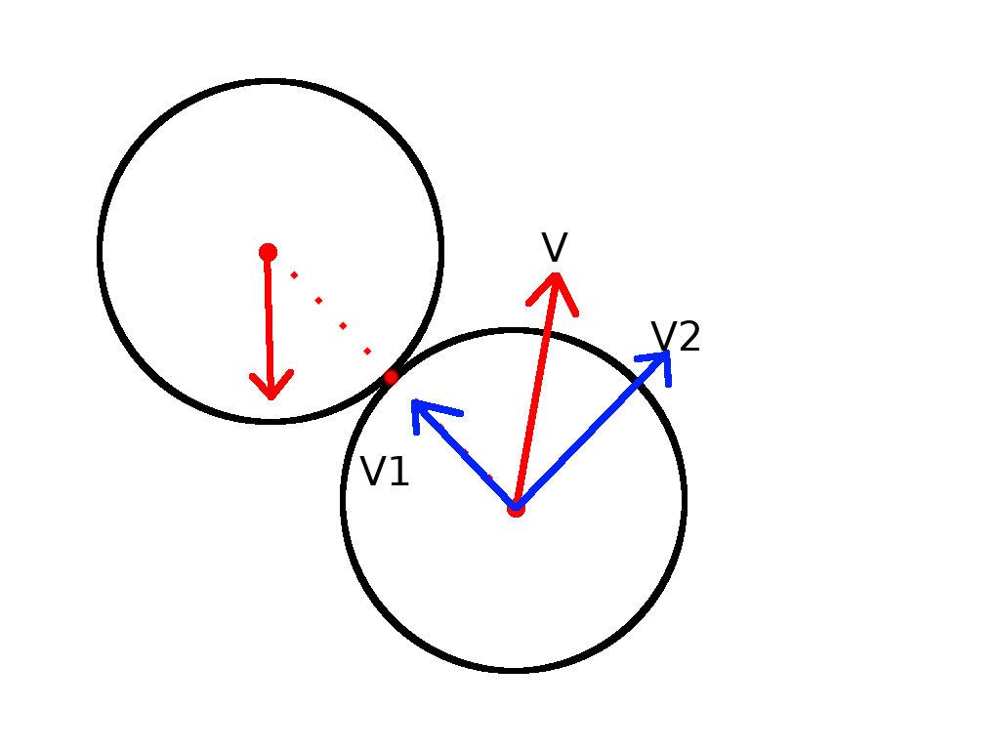

# Analysis

## Introduction

This project is about making a 8 ball pool game with a top down view. The game will:

* be played by 2 people on a single computer
* use the standard pool rule set
* have ball animations (should visibly rotate)
* have realistic physical interactions (ball collisions and friction)

Therefore, this project will deal with 3d rendering, physical simulation and game development areas of computer science.

## Identification of End Users

The main end users of this project are my school friends who are interested in playing a computer version of pool.
My project will be hosted on GitHub[@githubrepo], so other people can play the game for free.

## Evidence of analysis

To better understand the problem I had to solve, I decided to interview one of my sixth form classmates about it:

__What are you having problems at the moment?__

_We were supposed to have a pool table installed in the common room this year, but the student union didn't have enough money to do that. Our group has a lot of free time in school, and we really want to play pool against each other, even if it's on a computer_

__Have you found anything online which works as you want?__

_We have found some pool games online, but most of them are player vs AI and require internet connection, which, unfortunately, you can't take for granted. In our case we don't really need to be able to play via the internet, an offline game should be fine_

__Is there anything specific you want in the game?__

_A normal pool game with rules for 2 players should suffice. It shouldn't be too slow or lag. Obviously, the balls and their movement should look like in real life. It would be interesting to have a sandbox or something which allows the user to tweak with the game options like cue hit power or the ball size._

The user asked for standard features for this game, except for the sandbox mode. That can be achieved in different ways, like an in-game or a configuration file, which is present in many new games. Other than that request, the user needs mostly reflect ones outlined in *Introduction*.

## Objectives

* The rules of pool should be implemented in the game
* The game should run at more than 30 frames per second
* Physical interactions in the game should be realistic:
  * The movement of the balls should be affected by friction
  * The game should detect and resolve ball to ball and ball to table side collisions
* Game animations look realistic:
  * The balls should visibly *rotate* when moving
  * The cue should move towards the ball when a player is hitting a ball
* A configuration file, which can change some of the in-game options like ball size or cue hit power

## Proposed Solution

### Language Choice
At the beginning of the project, I was experienced in two programming languages - Python and Pascal. To pick one, I had to do some research on their suitability for the job.
According to the Tiobe Index[@tiobe] and PYPL[@pypl], python is significantly more popular than Pascal and hence is a better language to use due to more resources available online (e.g. more StackOverlow questions/answers). This also suggests that python will have higher quality/variety of libraries due to a larger community. Additionally, python is a duck-typed language, which means no explicit type declarations are required. This makes python less verbose and more flexible, allowing for faster development, which is beneficial given a limited amount of time for development. Finally, a game development library will be at the core of my project so it is important to pick a language with a mature, well maintained game development framework.
A number of resources list the most popular libraries used for implementing games in Pascal[@fpcgameengine][@delphigamedev]. All of these libraries are either missing completely (home page is broken), seriously outdated or are very immature. At the same time, python has Pygame[@pygamegithub] which is open source, actively maintained (at the time of writing last commit 3 days ago) and mature (3k commits with 40 contributors).

### Pool Rules
To implement the rules of pool I had to go online and read about the game rules[@poolrules], here are the main points:

* The first break should be performed behind the white line on the table, and the ball may be placed anywhere behind that line.
* If the players haven't decided which group of balls they are on, and the player pots a ball or several balls of a particular group, that player now is on that group.
* To win the game, you must pot the 8 ball legally.
* You must first sink every ball from the group you are on, to pot the 8 ball.
* Failure to hit a ball from your group on your first ball hit, or not hitting a ball at all on your turn, gives your opponent a hit *from his hand* (which means that he is allowed to put the white ball anywhere on the table)
* If you pot the 8 ball illegally, you lose the game.

### Collisions
There will be 3 types of collision - ball to ball, ball to table side and ball to pocket. Every frame the game will check for these collisions, and if it detects any, it will resolve the collision based on the velocity and the position of the balls using linear algebra and vector operations.
To understand the maths behind the collisions I will use my knowledge from M1 and M2 modules of my mathematics course and the information I found online[@wiki_elasticcollisions][@gamasutra]. The program will use physical ideas like Newtons laws and conservation of momentum to implement realistic collisions.

### Rendering
Some parts of the balls will (like the white stripe around the balls) be modeled as 3d objects,rotated using rotation matrices when the ball is moving and then projected on the table (into a 2d space).

### Cue
The cue will be modeled as rectangle, which the player can click and draw to perform a hit. The power of the hit will be proportional to the displacement of the cue from the ball.

### Friction
There are 2 friction types in my program:

* Movement friction (balls loosing energy because of friction with the table)
* Collision friction (balls loosing energy because of internal friction on collision)

To model movement friction I will use the formula $F=C_{rr}N$ where $C_{rr}$ is the coefficient of rolling resistance of the balls[@rollingfriction]. That means the balls will have a constant frictional force on them (when they are moving).

To model friction on collision, I will use the inelastic collision formula[@collisionfriction]. The formula depends on the *coefficient of restitution* - $e$, whose values range from 0 to 1 (1 being a perfectly elastic collision and 0 perfectly inelastic). Low values of $e$ mean that there is a lot of energy lost in collision and visa versa.

# Documented design

## Object diagram

The project has a lot of different classes, and I have made object diagrams from every file in the project.


## Modular Design

* Main menu
  * The game
    * Stop the game
    * Game over
  * Quit the game

## Algorithms

### Collision detection

One way detect a ball to ball collision is to check the distances between every ball every frame and, if the distance between two balls is less than the sum of their radii, that means that they have collided.


Unfortunately, this strategy doesn't always work. That is because this strategy doesn't take into consideration the direction the balls are going. For example, in the previous picture, if the balls are going in the opposite directions, the balls shouldn't collide because if they do, they are going to be moving towards each other after the collision, which isn't right.


We have to consider the directions of the balls velocities to detect collisions accurately. To do that we will take the dot product of the difference between the position vectors of 2 balls (labeled _distance diff_ on the figure) and the velocity difference vector (labeled as _v1-v2_ on the figure). If the result is positive that means that the balls are moving towards each other and we can collide them.


### Collision resolution

There are 2 types of collisions in the game - _ball to line_ and _ball to ball_ which are somewhat similar. Both types are resolved using Newtonian physics.

#### Ball to line:

When a ball collides with a line the perpendicular component of the balls velocity to the line is reversed and multiplied by $\frac{1+e}{2}$. The component parallel to the line is unchanged. This is because the force from the wall on the ball is applied strictly perpendicularly to the line.

#### Ball to ball:

If we get the projections of the velocity of the ball onto the vector which goes from the centre of the first circle to the second circle, we see that only one of the components of the velocity will be affected (only _V1_ will be changed on the figure). This is because there is only 1 point of interaction between the balls, meaning any forces will have to go from the centre of mass of a ball, through that point.



The result is that we can use 1-dimensional collision formulas here, even though we have a 2-dimensional collision. We do that by only considering the velocity component which goes through the collision point (_V1_) and leave the other velocity component unchanged (_V2_ on the figure).

The general formula for a 1-dimensional collision is[@collisionfriction]:
$$
V'_1=\frac{(1+e)M_1}{M_1+M_2}V_2
$$
Where $e$ is the coefficient of restitution (explained in analysis), $M_1$ and $M_2$ are the masses of the first and second balls, respectively. $V'_1$ is the velocity of the first ball after the collision and $V_2$ is the velocity of the second ball prior to the collision.

In our case, the masses of the balls are all the same, which gives us:
$$
V'_1=\frac{(1+e)}{2}V_2
$$
To summarise, we split the ball velocities into 2 vectors: one vector - $V_a$, which goes through the collision point and the other vector - $V_b$, which is at 90 degrees to the first vector , then the formula for the velocity after the collision is:
$$
V'_1=\frac{(1+e)}{2}V_{a2}+V_{b1}
$$

### Cue stick click detection

Because the cue stick is modeled as a rectangle, the problem here can be simplified down to figuring out if a 2d point is in a rectangle (which is defined with 4 2d points). To do that we find the area of 4 triangles which can be made with 4 rectangle points and the points. We can find the area of triangles using herons formula.


The area of the green triangles equals the area of the cue, therefore the click is inside the cue.


### The main game loop

Pseudocode:
```
While not_closed:
    button_pressed_in_main_menu = main_menu_get_button()

    if button_pressed_in_main_menu == "Play_button":
        While not_closed or game_is_over():
            resolve_collisions()
            do_one_frame()

            If all_balls_not_moving():
                check_pool_rules()
                use_cue()

    if button_pressed_in_main_menu == "Exit_button":
        not_closed=False
```

This is the whole game split into functions. Every turn, one player uses the cue, then while the balls are moving, the game will check for any collisions, resolve them and do *one frame*, meaning it will move every moving object and redraw everything. The main game loop will continue doing that until the game is over or the game is closed.

## User Interface
The game has a very minimal user interface. The game has a small main menu.


The menu only has two buttons - *Play Pool*, upon clicking which the game starts, and *Exit* which exits the game. The buttons change color when the player mouses over the button.


Even though the menu is very minimal, it is very customizable. Many things can be customized in the menu section in the config file (config.py).

```
...
# menu
menu_text_color = (255, 255, 255)
menu_text_selected_color = (0, 0, 255)
menu_title_text = "Pool"
menu_buttons = ["Play Pool", "Exit"]
menu_margin = 20
menu_spacing = 10
menu_title_font_size = 40
menu_option_font_size = 20
exit_button = 2
play_game_button = 1
...
```
For example, to add a new button, you need to add a new string to `menu_buttons` array. And change the exit_button and the play_game_button variables. The variable exit_button has the index of the "exit button" which, when is clicked, closes the game.
```
# menu
...
menu_buttons = ["Play Pool", "Test", "Exit"]
...
exit_button = 3
play_game_button = 1
...
```


## Design  considerations

Judging from other computer games, the pool game should include these things:

* The game screen should be big enough to see everything clearly.
* The balls should look realistic, and have easily distinguishable stripes on them so the players would not be confused which balls they need to pot.
* The game should have aiming lines to help the player aim. These lines are needed because in real life the player can line up the ball and see where it will go, so the game should have similar functionality.
* The game should have a border so that the cue stick could be used even if the ball is in a corner.
* The game should have a minimal game menu.

## Input  considerations

* The game should be almost fully controlled through the cue stick to hit the balls. The cue will be interactive via the mouse. An exception to the previous rule is if the white ball was potted and it must be moveable. In that case the ball can be interacted with via the mouse, specifically if the game rules allow the ball to be moved the player can click the ball and move it.
* In the menu the main input method is the mouse, however the user should be able to quit the game by pressing ESC key.
* While in game, the user should be able to press the ESC button to close the game.

## Processing  considerations

* The balls will have a velocity and position vector. The velocity vector will be added to the position vector every second.
* There will be collision functions for ball to ball collisions and ball to wall collisions.
* The balls will have a function which will generate the ball sprite depending on the position and the movement of the ball.
* Functions which are responsible for checking that the game rules are not broken.


## File structure
The project contains many files, all of them have a special purpose.

* main.py is the main game file which uses every other file to make the game run
* collision.py is the file responsible for detecting various collisions, like ball to ball and ball to table side collisions.
* ball.py contains the Ball class.
* gamestate.py contains the game state class, which has various functions related to actual game flow like the rules of the game.
* config.py the configuration file which contains most of the constants of the game Most classes are in separate classes for ease of reading.

Ball the ball class contains all of the methods associated with the pool ball, like sprite manipulation algorithms, position properties and others.
Game State has various functions related to actual game flow like the rules of the game.
Sprites table pieces like the table side and holes.

## Input Validation
In the game there is a special case  where there is a need for extra validation. When the player is allowed to move the ball, we must make sure that the player doesn’t move the ball outside of the game border or into another ball.


# Technical solution

## Debugging errors during the development of the program

### "Reverse" shot bug

This^[https://github.com/max-kov/pool/commit/872bdde305882ee68b771a3a03be3ab264d586ca] is a bug regarding the cue. If the cue is brought very close to the white ball, the game might think that the cue stick is inside the ball. That results into negative displacement, which when then produces a negative force on the ball (because the force from the cue on the ball is calculated based on it's displacement from the ball).


All of the code is available on github.com/max-kov/pool with testing results.

## collisions.py

```{r engine='bash', comment='', echo=F}
cat pool/collisions.py
```

## ball.py

```{r engine='bash', comment='', echo=F}
cat pool/ball.py
```

## config.py

```{r engine='bash', comment='', echo=F}
cat pool/config.py
```

## cue.py

```{r engine='bash', comment='', echo=F}
cat pool/cue.py
```

## event.py

```{r engine='bash', comment='', echo=F}
cat pool/event.py
```

## gamestate.py

```{r engine='bash', comment='', echo=F}
cat pool/gamestate.py
```

## graphics.py

```{r engine='bash', comment='', echo=F}
cat pool/graphics.py
```

## main.py

```{r engine='bash', comment='', echo=F}
cat pool/main.py
```

## physics.py

```{r engine='bash', comment='', echo=F}
cat pool/physics.py
```

## table_sprites.py

```{r engine='bash', comment='', echo=F}
cat pool/table_sprites.py
```

# Testing

## White box testing (Unit testing)
In my game there are two main things to test - the process of the physical simulation, meaning the mathematics behind the collisions, collision detection and others, and the user interface. To test the mathematics, I've made a set of tests in a form of a script, which, when executed, runs the main program with the test input data. These tests are considered white box testing, and, more specificaly, unit testing, because I am testing specific functions of the program (which I wrote myself).
To make the job of testing the game with every change easier, I have made unit tests which are executed on my code every time I make a commit to github. The unit tests are included with the game in the folder “tests”, the tests contain some input, which is used with the functions of the game which are responsible for a specific task. Lets look at a particular example:

```
def test_point_distance1(self):
    assert physics.point_distance(np.array([0, 0]), np.array([3, 4])) == 5
```
This function tests the function responsible for calculating the distance between two points. The function uses the function to calculate the distance between points (0,0) and (3,4), and compares it to 5. If the function does not return 5, the test returns an exception.
Here is another, more complicated example of an edge case test:

```
def test_movement4(self):
    ball1.set_velocity((1, 1))
    ball2.move_to(-fortyfive_degree_position)
    ball2.set_velocity((1, 1))
    assert not physics.ball_collision_check(ball1, ball2)
```


The test sets the balls such that they are touching, however, both balls are moving with the same velocity. That means there is no collision.

This is an example of an extreme test:

```
def test_movement10(self):
    ball1.set_velocity((0, 1))
    ball2.move_to((0, ball_radius * 2))
    ball2.set_velocity((200000000, -200000000000))
    assert physics.ball_collision_check(ball1, ball2)
```

The values in the test are exaggerated so that we know that the game can handle extreme values.


### To run the tests

The file contains many tests, including matrix transformation tests, line to ball collision tests and the triangle area test. Here is the file itself:

```{r engine='bash', comment='', echo=F}
cat tests/test_physics.py
```

Here is me running the tests on my machine on the lates pool build.

```
PYTHONPATH=./pool py.test --cov=.
========================= test session starts ==========================
platform linux -- Python 3.6.4, pytest-3.2.3, py-1.5.2, pluggy-0.4.0
rootdir: /home/max/code/python/pool, inifile:
plugins: cov-2.5.1, asyncio-0.8.0
collected 31 items

tests/test_physics.py ...............................

----------- coverage: platform linux, python 3.6.4-final-0 -----------
Name                    Stmts   Miss  Cover
-------------------------------------------
pool/__init__.py            0      0   100%
pool/ball.py              120     84    30%
pool/collisions.py         26     18    31%
pool/config.py             61      5    92%
pool/cue.py               100     80    20%
pool/event.py              18     12    33%
pool/gamestate.py         210    170    19%
pool/graphics.py           49     38    22%
pool/main.py               31     31     0%
pool/physics.py            44      7    84%
pool/table_sprites.py      77     56    27%
-------------------------------------------
TOTAL                     736    501    32%


====================== 31 passed in 0.39 seconds =======================
```

Tests for other builds and instructions on how to run the tests yourself can be found on the github repository page^[https://github.com/max-kov/pool]. The records of how the build passes the tests are available on github^[https://github.com/max-kov/pool/commits/master] or on Travis-ci^[https://travis-ci.org/max-kov/pool/builds].


# Evaluation

## Objective Analysis

## User Feedback

## Analysis of User Feedback

## Possible Extensions

# References
