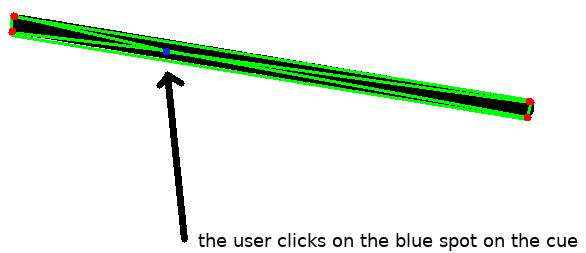
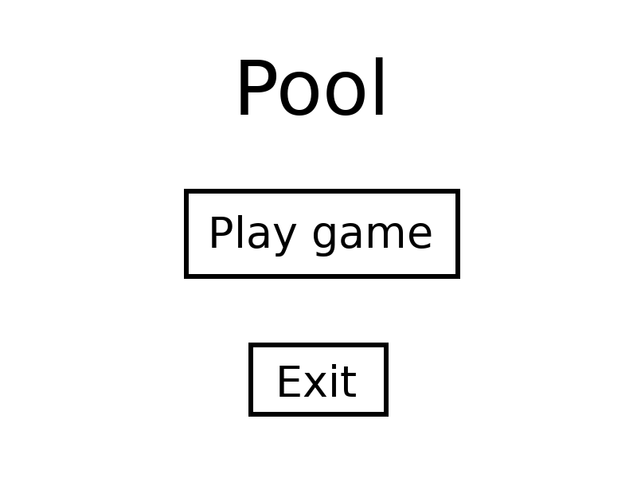

# Analysis

## Introduction

This project is for the most part an investigation into 3d rendering and physical simulation of rolling balls. To make the project more interactive it will take a form of a simple 2-player 2d pool game.

## Identification of End Users

The main end users of this project are my school friends who are interested in playing a computer version of pool.
My project will be hosted on GitHub [@githubrepo], so other people can play the game for free.

## Objectives

* The rules of pool should be implemented in the game
* The game should run at more than 30 FPS
* Game mechanics should closely represent real-world behaviour:
  * The game should be able to detect ball collisions
  * The game should be able to resolve ball to ball collisions according to Newtons Laws
  * The game should be able to resolve collisions with the pool table
* Game animations look realistic:
  * The balls should visibly *rotate* when moving
  * The cue should move towards the ball when a player is hitting a ball

## Object diagram

The project has a lot of different classes, and I have made object diagrams from every file in the project.


## Proposed Solution

The program will implement classes for better code readability and maybe even some of the harder OOP ideas like overloading. The program will store the information about the state of the game, which will mostly consist of the coordinates and the velocity of the pool balls on the table. There will be 3 types of collision - ball to ball, ball to table side and ball to table hole. Every frame the game will check for these collisions, and if it detects any, it will resolve the collision based on the velocity and the position of the balls using linear algebra and vector operations.
The game would be written in python and some additional libraries:

* Pygame
* Numpy
* Zope.Event

### Pygame

Python has a library called turtle that is part of the standard python installation, however it’s mainly for education purposes and does not nearly have the functionality for making a pool game. Here is an except from the Pygame website
Pygame (the library) is a Free and Open Source python programming language library for making multimedia applications like games built on top of the excellent SDL library. Like SDL, Pygame is highly portable and runs on nearly every platform and operating system.

### Numpy

Numpy is a powerful tool for numerical calculations often involving matrices. In this project matrices are used for drawing the ball sprites, specifically 3d rotation matrices.

## Evidence of Analysis

The game will have to resolve elastic ball collisions and other physical processes. To understand the maths behind the collisions I will mainly use my knowledge from maths Mechanics 1 and 2 modules but I will also research the topic online[@wiki_elasticcollisions][@gamasutra].

## Critical Path
To make the development easier, I'm going to split the program in 4 stages:
* In the first stage I will implement the general shapes and objects - the table the balls. The balls will have position and velocity vectors but collisions at this stage of the game will be ignored
* In the second stage I will ball collisions with the table and with other balls.
* In the third stage I will add the cue stick and the table pockets. The physics of the game should be finished after this stage.
* In the fourth and final stage I will add the "game" parts of the game, namely, pool rules (stuff like player turns and whether you are allowed to move the white ball on your turn) and a main menu.

# Documented design

## Overall System Design

## Modular Design

* Main menu
  * The game
    * Stop the game
    * Game over
  * Quit the game

## Algorithms

### Collision detection

One way detect a ball to ball collision is to check every frame the distances between every ball and, if the distance between two balls is less that the sum of their radii, that means that they have collided.


Unfortunately, such a strategy sometimes makes the balls "stick" to each other. That is because this strategy doesn't take into consideration the direction the balls are going. For example, in the previous picture, if the balls are going in the opposite directions, the balls shouldn't collide because if they do, they are going to be moving towards each other after the collision, which isn't right.


We have to consider the directions of the balls velocities to detect collisions accurately. To do that we will take the dot product of the displacement difference between 2 balls^[take away the displacement vector of the first ball from the second one] and the velocity difference vector (labeled as v1-v2 on the figure). If the result is positive that means that the balls are moving towards each other and we can collide them.


### Collision resolve

There are 2 types of collisions in the game - _ball to line_ and _ball to ball_ which are actually closely related. Both types are resolved using Newtonian physics.

* Ball to line:
  When a ball collides with a line the perpendicular component of the balls velocity to the line is reversed (multiplied by -1). The component parallel to the line is unchanged. This is because the force from the wall on the ball is applied strictly perpendicularly to the line.

* Ball to ball:
  Using the law of the conservation of momentum we do
  $$m_1*u_1 + m_2*u_2 = m_1*v_1 + m_2*v_2$$
  Normally to calculate the ball collision vectors you would have to consider kinetic energies and momentum to resolve properly, but if the masses of the balls are the same you could do a shortcut.
  \begin{align}
  m*u_1 + m*u_2 &= m*v_1 + m*v_2\\
  u_1 + u_2 &= v_1 + v_2\\
  v_1 - u_1 &= -(v_2 - u_2)\\
  \Delta v_1 &= -\Delta v_2
  \end{align}
  From this we see that any change in speed in the first ball has to be provided by the second ball, in other words the change in the velocity of the first ball will equal to change of the velocity of the second ball. When a ball collides with a ball the force on the balls goes through the collision point between the balls. Furthermore, since we are modeling elastic collisions we know that initial and final velocity will be equal, therefore the component of the balls velocity that goes through the collision point is flipped.


### Cue stick click detection
Because the cue stick is modeled as a rectangle, the problem here can be simplified down to figuring out if 2d point is in a rectangle (which is defined with 4 2d points). To do that we find the area of 4 triangles which can be made with 4 rectangle points and the points. We can find the area of triangles using herons formula.




The area of the green triangles equals the area of the cue, therefore the click is inside the cue.


### The main game loop

Pseudocode:
```
While not_closed:
    button_pressed_in_main_menu = main_menu_get_button()

    if button_pressed_in_main_menu == "Play_button":
        While not_closed or game_is_over():
            resolve_collisions()
            do_one_frame()

            If all_balls_not_moving():
                check_pool_rules()
                use_cue()

    if button_pressed_in_main_menu == "Exit_button":
        not_closed=False
```

This is the whole game split into functions. Every turn, one player uses the cue, then while the balls are moving, the game will check for any collisions, resolve them and do *one frame*, meaning it will move every moving object and redraw everything. The main game loop will continue doing that until the game is over or the game is closed.

## User Interface
The game has a very minimal user interface. The game has a small main menu.



The menu only has two buttons - *Play Pool*, upon clicking which the game starts, and *Exit* which exits the game. The buttons change color when the player mouses over the button.


Even though the menu is very minimal, it is very customizable. Many things can be customized in the menu section in the config file (config.py).

```
...
\# menu
menu_text_color = (255, 255, 255)
menu_text_selected_color = (0, 0, 255)
menu_title_text = "Pool"
menu_buttons = ["Play Pool", "Exit"]
menu_margin = 20
menu_spacing = 10
menu_title_font_size = 40
menu_option_font_size = 20
exit_button = 2
play_game_button = 1
...
```
For example, to add a new button, you need to add a new string to `menu_buttons` array. And change the exit_button and the play_game_button variables. The variable exit_button has the index of the "exit button" which, when is clicked, closes the game.
```
\# menu
...
menu_buttons = ["Play Pool", "Test", "Exit"]
...
exit_button = 3
play_game_button = 1
...
```


## Design  considerations

Judging from other computer games, the pool game should include these things:

* The game screen should be big enough to see everything clearly.
* The balls should look realistic, and have easily distinguishable stripes on them so the players wouldn’t be confused which balls they need to pot.
* The game should have aiming lines to help the player aim. These lines are needed because in real life the player can line up the ball and see where it will go, so the game should have simillar functionality.
* The game should have a border so that the cue stick could be used even if the ball is in a courner.
* The game should have a minimal game menu.

## Input  considerations

* The game should be almost fully controlled through the cue stick to hit the balls. The cue stick will be interactable via the mouse. An exception to the previous rule is if the white ball was potted and it must be moveable. In that case the ball can be interacted with via the mouse, specifically if the game rules allow the ball to be moved the player can click the ball and move it.
* In the menu the main input method is the mouse, however the user should be able to quit the game by pressing ESC key.
* While in game, the user should be able to press the ESC button to close the game.

## Processing  considerations

* The balls will have a velocity and position vector. The velocity vector will be added to the position vector every second.
* There will be collision functions for ball to ball collisions and ball to wall collisions.
* The balls will have a function which will generate the ball sprite depending on the position and the movement of the ball.
* Functions which are responsible for checking that the game rules are not broken.


## File structure
The project contains many files, all of them have a special purpose.

* main.py is the main game file which uses every other file to make the game run
* collision.py is the file responsible for detecting various collisions, like ball to ball and ball to table side collisions.
* ball.py contains the Ball class.
* gamestate.py contains the game state class, which has various functions related to actual game flow like the rules of the game.
* config.py the configuration file which contains most of the constants of the game Most classes are in separate classes for ease of reading.

Ball the ball class contains all of the methods associated with the pool ball, like sprite manipulation algorithms, position properties and others.
Game State has various functions related to actual game flow like the rules of the game.
Sprites table pieces like the table side and holes.

## Input Validation
In the game there is a special case  where there is a need for extra validation. When the player is allowed to move the ball, we must make sure that the player doesn’t move the ball outside of the game border or into another ball.


# Technical solution

## Debugging errors during the development of the program

### "Reverse" shot bug

This^[https://github.com/max-kov/pool/commit/872bdde305882ee68b771a3a03be3ab264d586ca] is a bug regarding the cue. If the cue is brought very close to the white ball, the game might think that the cue stick is inside the ball. That results into negative displacement, which when then produces a negative force on the ball (because the force from the cue on the ball is calculated based on it's displacement from the ball).


All of the code is available on github.com/max-kov/pool with testing results.

## collisions.py

```{r engine='bash', comment='', echo=F}
cat pool/collisions.py
```

## ball.py

```{r engine='bash', comment='', echo=F}
cat pool/ball.py
```

## config.py

```{r engine='bash', comment='', echo=F}
cat pool/config.py
```

## cue.py

```{r engine='bash', comment='', echo=F}
cat pool/cue.py
```

## event.py

```{r engine='bash', comment='', echo=F}
cat pool/event.py
```

## gamestate.py

```{r engine='bash', comment='', echo=F}
cat pool/gamestate.py
```

## graphics.py

```{r engine='bash', comment='', echo=F}
cat pool/graphics.py
```

## main.py

```{r engine='bash', comment='', echo=F}
cat pool/main.py
```

## physics.py

```{r engine='bash', comment='', echo=F}
cat pool/physics.py
```

## table_sprites.py

```{r engine='bash', comment='', echo=F}
cat pool/table_sprites.py
```

# Testing

## White box testing (Unit testing)
In my game there are two main things to test - the process of the physical simulation, meaning the mathematics behind the collisions, collision detection and others, and the user interface. To test the mathematics, I've made a set of tests in a form of a script, which, when executed, runs the main program with the test input data. These tests are considered white box testing, and, more specificaly, unit testing, because I am testing specific functions of the program (which I wrote myself).
To make the job of testing the game with every change easier, I have made unit tests which are executed on my code every time I make a commit to github. The unit tests are included with the game in the folder “tests”, the tests contain some input, which is used with the functions of the game which are responsible for a specific task. Lets look at a particular example:

```
def test_point_distance1(self):
    assert physics.point_distance(np.array([0, 0]), np.array([3, 4])) == 5
```
This function tests the function responsible for calculating the distance between two points. The function uses the function to calculate the distance between points (0,0) and (3,4), and compares it to 5. If the function does not return 5, the test returns an exception.
Here is another, more complicated example of an edge case test:

```
def test_movement4(self):
    ball1.set_velocity((1, 1))
    ball2.move_to(-fortyfive_degree_position)
    ball2.set_velocity((1, 1))
    assert not physics.ball_collision_check(ball1, ball2)
```


The test sets the balls such that they are touching, however, both balls are moving with the same velocity. That means there is no collision.

This is an example of an extreme test:

```
def test_movement10(self):
    ball1.set_velocity((0, 1))
    ball2.move_to((0, ball_radius * 2))
    ball2.set_velocity((200000000, -200000000000))
    assert physics.ball_collision_check(ball1, ball2)
```

The values in the test are exaggerated so that we know that the game can handle extreme values.


### To run the tests

The file contains many tests, including matrix transformation tests, line to ball collision tests and the triangle area test. Here is the file itself:

```{r engine='bash', comment='', echo=F}
cat tests/test_physics.py
```

Here is me running the tests on my machine on the lates pool build.

```
PYTHONPATH=./pool py.test --cov=.
========================= test session starts ==========================
platform linux -- Python 3.6.4, pytest-3.2.3, py-1.5.2, pluggy-0.4.0
rootdir: /home/max/code/python/pool, inifile:
plugins: cov-2.5.1, asyncio-0.8.0
collected 31 items

tests/test_physics.py ...............................

----------- coverage: platform linux, python 3.6.4-final-0 -----------
Name                    Stmts   Miss  Cover
-------------------------------------------
pool/__init__.py            0      0   100%
pool/ball.py              120     84    30%
pool/collisions.py         26     18    31%
pool/config.py             61      5    92%
pool/cue.py               100     80    20%
pool/event.py              18     12    33%
pool/gamestate.py         210    170    19%
pool/graphics.py           49     38    22%
pool/main.py               31     31     0%
pool/physics.py            44      7    84%
pool/table_sprites.py      77     56    27%
-------------------------------------------
TOTAL                     736    501    32%


====================== 31 passed in 0.39 seconds =======================
```

Tests for other builds and instructions on how to run the tests yourself can be found on the github repository page^[https://github.com/max-kov/pool]. The records of how the build passes the tests are available on github^[https://github.com/max-kov/pool/commits/master] or on Travis-ci^[https://travis-ci.org/max-kov/pool/builds].

## Other tests

Other features of the game, like the rules of the game, cannot be easily tested with maths, for that purpose, I have created a test table where I actually play out the scenarios described in-game.

Test description                                     Expected output                           Test type        Result                               Reference
--------------------------------------------------   ---------------------------------------   --------------   ------------------------------------------------------------------------   ---------------
Putting the white ball on top of another ball        Shouldn't be possible                     Erroneous        The game stops moving the ball when it come to contact with another ball
Pressing ESC in-game                                 Return to the main menu                   Typical          The game returns to the main menu
Pressing ESC in the main menu                        Exit the game                             Typical          The game terminates
Trying to extend the cue past what the game allows   The game should limit the cue extension   Extreme          The game stops the cue extending at a certain point
Clicking the cue without extending it                The ball shouldn't move                   Extreme          The ball moves towards the cue
--------------------------------------------------   ---------------------------------------   --------------   ----------------------------------   ---------------

# Evaluation

## Objective Analysis

## User Feedback

## Analysis of User Feedback

## Possible Extensions

# References
