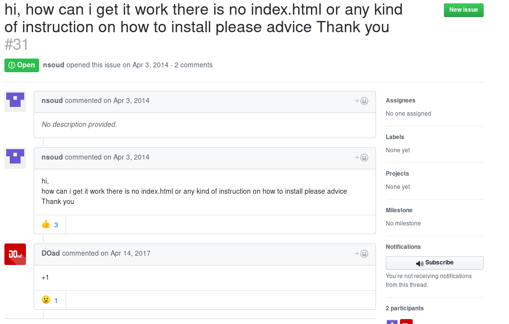
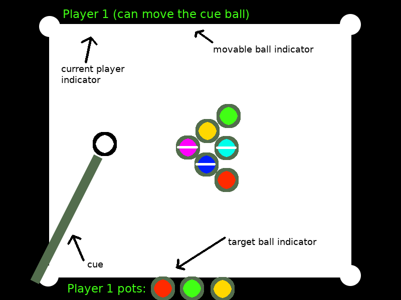
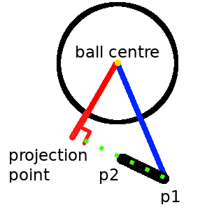
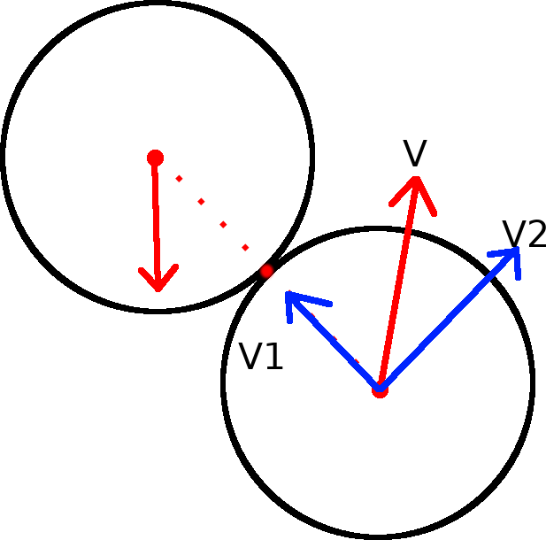
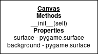
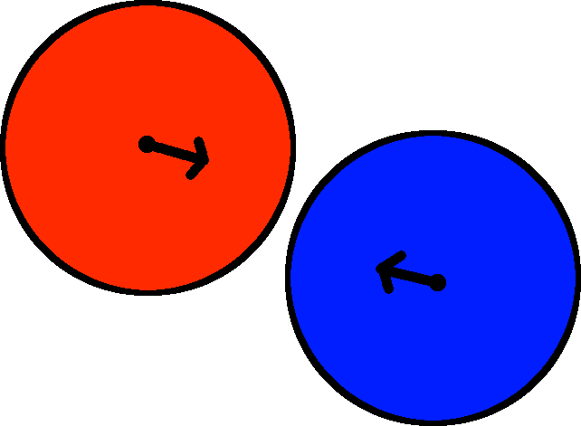
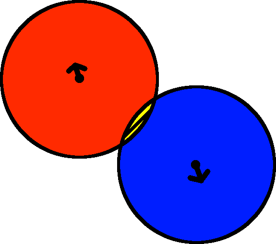

# Analysis

## Introduction

 Even though the video game industry didn't exist 4 decades ago, it is now one of the most popular hobbies of youth nowadays. With new variations on the original idea like mobile games and virtual reality games, it is likely that these games are here to stay for a long time. This project is about making a 8 ball pool game with a top down view that can be played by 2 players on the same computer.

## Identification of End Users

The main end users of this project are my school friends who are interested in playing a computer version of pool. The code will include the physical formulas of collisions and friction, and because this project will open-source and available online, this game might help other people to understand how 2-dimensional ball physics work.

## Available Alternatives

Most pool games online are hosted on online game websites like www.miniclip.com. These games don't provide the source code for their game which means that the users cannot learn about how the physics of the game work, but also the users won't be able to customize the game options like ball size or color.

I've looked on GitHub for pool games and there were some projects like mine, but most of the projects  we're abandoned, or unfinished [@githubpool1]. For example, the user raysmith619 has a similar repository. In his README file he says that the game is missing the pockets, friction and ball rotation animations. I see these things as very important to the game and will implement them. 

There is a big pool game project written in Ruby on Rails[@githubpool2]. The project is finished however, there are different problems with this project. Looking at the issues page of the projects, some users are having problems installing the software[@githubissue].



Additionally, looking at commit messages, you can see that the main maintainer was trying to add advertisements to the game, which is a bad idea for this project, because ads will make the user experience worse[@githubads].


To summarise, my game should have parts the mentioned games didn't have - pockets, friction and ball rotation animations. The game should have an instruction of how to install the game, so that users could acquire the game easily. Also, a 

## Evidence of Analysis

To better understand the problem I had to solve, I decided to interview one of my sixth form classmates about it:

__What are the problems with the current system?__

_We were supposed to have a pool table installed in the common room this year, but the student union didn't have enough money to do that. Our group has a lot of free time in school, and we really want to play pool against each other, even if it's on a computer._

__Have you found anything online which works as you want?__

_We have found some pool games online, but most of them are player vs AI and require internet connection, which, unfortunately, you can't take for granted. In our case we don't really need to be able to play via the internet, an offline game should be fine._

__Is there anything specific you want in the game?__

_A normal pool game with rules for 2 players should suffice. It shouldn't be too slow or lag. Obviously, the balls and their movement should look like in real life. It would be interesting to have a sandbox or something which allows the user to tweak with the game options like cue hit power or the ball size._

The user asked for standard features for this game, except for the sandbox mode. That can be achieved in different ways, like an in-game GUI or a configuration file, which is present in many new games. Other than that request, the user needs mostly reflect ones outlined in *Introduction*.

## Proposed Solution

This project will deal with 3d rendering, physical simulation and game development areas of computer science. Therefore, I researched some of the relevant techniques game developers use to create games.

### Collisions

To simulate ball collisions, every frame the game will check for these collisions by comparing the distances between ball centres, and if it detects any, it will resolve the collision based on the velocity and the position of the balls using linear algebra and vector operations. To model ball-ball and ball-table side collisions I can use the inelastic collision formula[@inelasticcollision]. The formula depends on the *coefficient of restitution* - $e$, whose values range from 0 to 1 (1 being a perfectly elastic collision and 0 perfectly inelastic). Low values of $e$ mean that there is a lot of kinetic energy lost in collision and visa versa.

### Rendering
Some parts of the balls (like the white stripe around the balls) can be modeled as 3d objects and rotated using rotation matrices when the ball is moving and then projected on the table (into a 2d space). Matrices are rectangular arrays which enable us to do spacial transformations of objects. Here is an example of a matrix:

$$
\begin{bmatrix}
    1 & 2 & 0 \\
    2 & 8 & 2 \\
\end{bmatrix}
$$

Matrices are very useful when you want to manipulate vectors in space. For example, this matrix:

$$
\begin{bmatrix}
    cos(\theta) & -sin(\theta) \\
    sin(\theta) & cos(\theta) \\
\end{bmatrix}
$$

rotates points about the origin through an angle $\theta$ counterclockwise. To rotate a vector by the matrix, you must do matrix multiplication. If you have 2 matrices $A$ and $B$, the matrix multiple $C$ is defined like this:

$$
A=
\begin{bmatrix}
    a_{11}&a_{12}&\cdots &a_{1m}\\
    a_{21}&a_{22}&\cdots &a_{2m}\\
    \vdots &\vdots &\ddots &\vdots \\
    a_{n1}&a_{n2}&\cdots &a_{nm}\\
\end{bmatrix}
,B=
\begin{bmatrix}
    b_{11}&b_{12}&\cdots &b_{1p}\\
    b_{21}&b_{22}&\cdots &b_{2p}\\
    \vdots &\vdots &\ddots &\vdots \\
    b_{m1}&b_{m2}&\cdots &b_{mp}\\
\end{bmatrix}
$$
$$
AB=
\begin{bmatrix}
    c_{11}&c_{12}&\cdots &c_{1p}\\
    c_{21}&c_{22}&\cdots &c_{2p}\\
    \vdots &\vdots &\ddots &\vdots \\
    c_{n1}&c_{n2}&\cdots &c_{np}\\
\end{bmatrix}
$$
Or
$$
ab_{ij}=a_{i1}b_{1j}+\cdots +a_{im}b_{mj}=\sum_{k=1}^{m}a_{ik}b_{kj}
$$
So, for example, if you have a point in 2-dimensional space $\vec k=(1,2)$ which you want to rotate 90 degrees counterclockwise, you compute:

$$
\begin{bmatrix}
    cos(90) & -sin(90) \\
    sin(90) & cos(90) \\
\end{bmatrix}
\begin{bmatrix}
    1 \\
    2 \\
\end{bmatrix}
=
\begin{bmatrix}
    -2 \\
    1 \\
\end{bmatrix}
$$

You can see the rotation represented on a 2d plane on the next figure.


### Friction
To model rolling friction I can use the formula $F=C_{rr}N$ where $C_{rr}$ is the coefficient of rolling resistance of the balls[@rollingfriction]. That means the balls will have a constant frictional force on them (when they are moving).

### Language Choice
At the beginning of the project, I was experienced in two programming languages - Python and Pascal. To pick one, I had to do some research on their suitability for the job.

The programming language of my choice should be able to deal with matrix manipulations outlined earlier. Both languages support array data structures, however, Python has a numerical computations library - Numpy[@numpy]. This library has implemented functions for matrix operations, like matrix multiplication and more.

According to the Tiobe Index[@tiobe] and PYPL[@pypl], Python is significantly more popular than Pascal and hence is a better language to use due to more resources available online (e.g. more StackOverlow questions/answers). This also suggests that python will have higher quality/variety of libraries due to a larger community. Additionally, Python is a duck-typed language, which means no explicit type declarations are required. This makes Python less verbose and more flexible, allowing for faster development, which is beneficial given a limited amount of time for development.

Finally, a game development library will be at the core of my project so it is important to pick a language with a mature, well maintained game development framework. A number of resources list the most popular libraries used for implementing games in Pascal[@fpcgameengine][@delphigamedev]. All of these libraries are either missing completely (home page is broken), seriously outdated or are very immature. At the same time, Python has Pygame[@pygamegithub] which is open source, actively maintained (at the time of writing last commit 3 days ago) and mature (3k commits with 40 contributors).

## Objectives

* The rules of pool should be implemented in the game
* The game should run at more than 30 frames per second
* Physical interactions in the game should be realistic:
  * The movement of the balls should be affected by friction
  * The ball collisions should be inelastic
  * The game should detect and resolve ball-ball and ball-table side collisions
* Game animations look realistic:
  * The balls should visibly *rotate* when moving
  * The cue should move towards the ball when a player is hitting a ball
* A configuration file, which can change some of the in-game options like ball size or cue hit power
* An installation guide/README file for users

## Acceptable Limitations

After researching the multiplayer feature, I think it will be unfeasible for me to implement it alone. Implementing multiplayer will require good theoretical knowledge of networking and sockets, but the main problem is that adding multiplayer will add a lot of validation problems between clients, this would require a server, which I don't have.


# Documented Design

## User Interface

A good pool game should implement the following features:

* The game screen should be big enough to see everything clearly.
* The balls should look realistic, and have easily distinguishable stripes on them so the players would not be confused which balls they need to pot.
* The game should have aiming lines to help the player aim. These lines are needed because in real life the player can line up the ball and see where it will go, so the game should have similar functionality.
* The game should have a minimal game menu with a button to start the game and leave the game.


In-game interface will consist of the cue, which can be aimed and retracted back to make a shot. The game will also have some indicators of the state of the game:

* A "current player" indicator (which can just be a label on the top)
* An indicator of which balls the players need to pot to win the game
* An indicator of whether the current player can move the cue ball



### Controls

* The user will use the mouse to move the cue or the cue ball (if it is movable).
* In the menu the main input method is the mouse, however the user should be able to quit the game by pressing ESC key.
* While in game, the user should be able to press the ESC button to leave to the main menu.

### Pool Rules
To implement the rules of pool I went online and read about the game rules[@poolrules], here are the main points:

* The first break should be performed behind the white line on the table, and the ball may be placed anywhere behind that line.
* If the players haven't decided which group of balls they are on, and the player pots a ball or several balls of a particular group, that player now is on that group.
* To win the game, you must pot the 8 ball legally.
* You must first sink every ball from the group you are on, to pot the 8 ball.
* Failure to hit a ball from your group on your first ball hit, or not hitting a ball at all on your turn, gives your opponent a hit *from his hand* (which means that he is allowed to put the white ball anywhere on the table)
* If you pot the 8 ball illegally, you lose the game.

## Algorithms

### Rendering

The ball can be split in 3 parts which must be rendered separately:

* The ball stripe
* The label (circle with the number)
* The solid color body


A sphere of a solid color will look like a circle from any angle in 2-dimensions. That's why we don't need to worry about any rotations of the solid sphere component. Hence we can just draw the solid body as a solid circle and draw everything else on top.

The stripe on the ball will be modeled as an array of 3-dimensional vectors ($\vec k = (x,y,z)$). The line array $a$ is defined as

$$
a=
\begin{bmatrix}
    \vec k_{1}, & \vec k_{2}, & \vec k_{3}, & \dots, & \vec k_{n}
\end{bmatrix}
$$

Where $\vec k_n$ is a 3d vector on the surface of the ball. We will draw lines from $\vec k_1$ to $\vec k_2$, from $\vec k_2$ to $\vec k_3$ and so on for every adjacent pair of points (a line from $\vec k_{i-1}$ to $\vec k_{i}$ for $i\in[2,n]$). This will draw a polygon that very closely follows the shape of the stripe.

When the ball moves the line array is rotated using rotation matrices. A 3d rotation matrix can be calculated from a rotation axis and an angle through which the ball needs to be rotated. We know the axis of rotation - it is the line perpendicular to the velocity vector and parallel to the table surface, and the angle of rotation is calculated using the formula
$$
\theta=\frac{vt}{r}
$$
where $v$ is the linear speed of the ball and $r$ is the radius of the ball with $\theta$ being in radians. The intuition for the formula is that when the ball is moving, every point on the circumference must touch the ground before it does a full rotation, therefore it must move $2\pi r$ units for a full rotation. The angle the ball has rotated is therefore given by $\theta = \frac{S}{r}$, where $S$ is the linear distance the ball has traveled. Then we substitute the formula $S=vt$ to get the aforementioned formula.

The rotation matrices are calculated using the Euler–Rodrigues formula. The rotated vector $\vec k\prime$ is calculated according to this formula:
$$
\vec k\prime =
\begin{bmatrix}
    a^2+b^2-c^2-d^2 & 2(bc-ad) & 2(bd+ac) \\
    2(bc+ad) & a^2+b^2-c^2-d^2 & 2(cd-ab) \\
    2(bd-ac) & 2(cd+ab) & a^2+b^2-c^2-d^2
\end{bmatrix}
\vec k
$$

Where $a,b,c,d$ are

\begin{gather*}
a = cos(\frac{\phi}{2}) \\
b = v_{x}sin(\frac{\phi}{2}) \\
c = v_{y}sin(\frac{\phi}{2}) \\
d = v_{z}sin(\frac{\phi}{2})
\end{gather*}

With $\phi$ being the rotation angle and $\vec v=(v_{x},v_{y},v_{y})$ being the unit vector of the axis of the rotation[@matrixmathworld][@stanfordhandout1][@stanfordhandout2].

Every frame the rotation matrix is calculated and applied to every vector in the line array. When the line is drawn, if the $z$-axis value of a vector is less than $0$, the point is ignored. That is because the centre of the ball is always at $z=0$ so anything below that is *under* the ball, and cannot be seen from a top-down view. So, before drawing the line array we filter out the every with $\vec k$ having $z\geq0$.

The label will be tracked with a single point. That point will be on the top of the ball when it's initialised and will be rotated with the same rotation matrix outlined earlier. Additionally, the label will be scaled depending on the orientation of the ball. For example, when the label is facing to the side, the width of the label sprite is squashed to values close to 0. To get the scale factor of this transformation, I will use the formula $SF=rd$, where $r$ is the radius of the ball, and $d$ is the distance of the label to the edge of the ball from the top-down view. One important thing to note is that this is a heuristic method. This technique produces realistic results, but isn't how it exactly works in real life. One method which would produce better results is surfel modeling[@surfel], but implementing something that complex is out of the scope of this project.

### Object Movement

Most objects which appear in the game will have a velocity vector and a position vector. Every frame the computer will erase the old object and redraw it on its new position to simulate movement. For example, to simulate ball movement the computer will draw a circle of the background color on top of the old rendition of the ball (thus erasing it), add the velocity vector to the position vector of the ball and then draw a new rendering on its updated position.

If the objects don't move too fast and the game is running at moderate frames-per-second, the movement will look smooth.

### Collision Detection

#### Ball-Ball

One way detect a ball-ball collision is to check the distances between ball centres every frame and, if that distance is less than the sum of their radii, that means that they have collided.


#### Ball-Pocket

In the game, any ball which has its _centre of mass_ inside a pocket is considered potted and is instantly removed from the game. Therefore, the algorithm only needs to check if the distance from the centre of the ball to the centre of the pocket is smaller than the radius of the pocket, and if it is, the ball is removed.
Because pockets are modeled as spheres, we use the same algorithm to detect collisions for both balls and pockets.

#### Ball-Line

This collision is called ball-line, because the table walls are modeled as lines. To detect such a collision we need to get the perpendicular distance from the centre of the ball to the line.


We know the position of the ball centre, its radius, and 2 points (p1 and p2 on the figure) which define the line. First we find the unit vector of the line (vector from p1 to p2) and the distance vector from one of the points to the ball centre (blue line on the figure). Then we get the distance from p1 to the perpendicular projection point using the _dot product_ on the aforementioned vectors. Note that the result will be a scalar quantity. To get the actual projection point we multiply the scalar value by the unit line displacement vector we got earlier to get the _projection point_ (as labeled on the figure). Then we can get the perpendicular distance from the line to the ball centre by using Pythagorean theorem. We can compare that distance to the balls radius to determine if the ball is colliding with the line.

However, there is one final caveat:



it's possible for the projected point to be outside of the line. To check that its not the case, we check that the distance from p1 and p2 to the projected point is less than the length of the line (distance from p1 to p2).

### Collision resolution

#### Ball-Line

 As mentioned in Analysis, when a ball collides with a line the perpendicular component of the balls velocity to the line is reversed and multiplied by $\frac{1+e}{2}$. The component parallel to the line is unchanged. This is because the force from the wall on the ball is applied strictly perpendicularly to the line.

#### Ball-Ball

To resolve a ball-ball collision we need to split the velocities of both balls into 2 perpendicular components. One component is parallel to the vector connecting the centres of the balls and the other one perpendicular to the first component.



Just as with the ball-line collision scenario, the component perpendicular to the vector connecting the centres of the balls stays unchanged after the collision while the parallel component needs to be calculated using the inelastic collision formula[@inelasticcollision]:

$$
V'_1=\frac{(1+e)M_1}{M_1+M_2}V_2
$$

Where $e$ is the coefficient of restitution (explained in analysis), $M_1$ and $M_2$ are the masses of the first and second balls, respectively. $V'_1$ is the velocity of the first ball after the collision and $V_2$ is the velocity of the second ball prior to the collision.

In our case, the masses of the balls are all the same, which gives us:
$$
V'_1=\frac{(1+e)}{2}V_2
$$
To summarise, we split the ball velocities into 2 vectors: one vector - $V_a$, which goes through the collision point and the other vector - $V_b$, which is at 90 degrees to the first vector , then the formula for the velocity after the collision is:
$$
V'_1=\frac{(1+e)}{2}V_{a2}+V_{b1}
$$

### Cue Click Detection

Because the cue is modeled as a rectangle, the problem here can be simplified down to figuring out if a 2d point is in a rectangle (which is defined with 4 2d points). To do that we find the area of 4 triangles which can be made with 4 rectangle points and the points. We can find the area of triangles using herons formula.


The area of the green triangles equals the area of the cue, therefore the click is inside the cue.


The user clicks on the blue dot which is outside the black cue. The sum of the areas of the green triangles is greater than the area of the cue, thus the point is outside of the cue.

### The main game loop

Pseudocode:

```
while True:
    while not game_is_over():
        resolve_collisions()
        move_everything()
        redraw_everything()

        if all_balls_stopped():
            apply_pool_rules()
            wait_for_cue_hit()
```

This is the whole game split into functions. Every turn, one player uses the cue, then while the balls are moving, the game will check for any collisions, resolve them and do one frame, meaning it will move every moving object and redraw everything. The main game loop will continue doing that until the game is over or the game is closed.


### Modular Design

* Main menu
  * The game
    * Stop the game
    * Game over
  * Quit the game

### Development considerations

#### Version Control

To be more productive and avoid code loss situations, I will use version control, specifically git, which is the most popular version control framework [@versioncontrol]. Storing a git repository exclusively on a local machine is dangerous since in case of a disk failure all data is lost. To ensure this never occurs, I will regularly upload my code to GitHub, which is a cloud service which allows storing git repositories on their server.

#### Additional Libraries and Library Management

For complex mathematical operations (mostly matrix operations in this project), I used Numpy, a numerical library for python which in addition to a wide range of scalar functions provides a multitude of vector functions.

For managing dependencies I chose pip (all project requirements are specified in requirements.txt), which is a common dependency manager used for python.

## Game Objects and Classes

Most game objects, like balls and cue, will be encapsulated into separate classes with  for the ease of testing and maintaining.




## Input Validation

When a player is allowed change the game state, we must make sure that the player won't abuse anything with these rules:

* When the player is allowed to move the ball, check that the player does not move the ball outside of the game border or into another ball.
* When the player is using the cue, it must not extend indefinitely (there should be a reasonable limit on the extension).
* The players should not be allowed to move the white ball out of the white line region on the first hit.

# Technical solution

## main.py

```{r engine='bash', comment='', echo=F}
cat pool/main.py
```

## gamestate.py

```{r engine='bash', comment='', echo=F}
cat pool/gamestate.py
```

## physics.py

```{r engine='bash', comment='', echo=F}
cat pool/physics.py
```

## collisions.py

```{r engine='bash', comment='', echo=F}
cat pool/collisions.py
```

## ball.py

```{r engine='bash', comment='', echo=F}
cat pool/ball.py
```

## cue.py

```{r engine='bash', comment='', echo=F}
cat pool/cue.py
```

## graphics.py

```{r engine='bash', comment='', echo=F}
cat pool/graphics.py
```

## table_sprites.py

```{r engine='bash', comment='', echo=F}
cat pool/table_sprites.py
```

## event.py

```{r engine='bash', comment='', echo=F}
cat pool/event.py
```

## config.py

```{r engine='bash', comment='', echo=F}
cat pool/config.py
```


# Testing

## Bugs Fixed During the Development of the Program

### "Reverse" Shot Bug

If the cue is brought very close to the white ball, the game might think that the cue is inside the ball. That results into negative displacement, which when then produces a negative force on the ball (because the force from the cue on the ball is calculated based on it's displacement from the ball).

Code changed (pool/cue.py line 114)[@reverseshotcommit]:

```
-        if self.displacement > config.ball_radius:
+        if self.displacement > config.ball_radius+config.cue_safe_displacement:
```

The new variable `config.cue_safe_displacement` is defined in the configuration file, and defines how far the cue can be displaced, before the ball will be affected. For example, if the user displaces the cue by 10 units, but and `config.cue_safe_displacement` is 15, if the user releases the cue, the ball will be unaffected, and the cue will be returned into its initial position.

### Collision Resolution Bug

Sometimes, during the play of the game, the balls would sometimes "stick" to each other. Turns out there was a problem with the resolution of the collision, or more precisely, when it was triggered.

The problem is caused by when 2 balls overlap. When the balls collide, there will inevitably will be some overlap, at least because of rounding errors. If the balls are moving quickly, the overlap may be significant.




Because the collision is inelastic one of the balls (or both) will lose some kinetic energy, and will therefore will be moving slower than before. If the balls are moving approximately towards each other, both of the balls will be moving slower.



Because of this loss of velocity, sometimes after colliding and moving once (one frame) they will still be inside each other, and thus the collision detection algorithm will trigger in the next frame again. If collision resolution algorithm is called on balls which are moving in opposite directions, the vectors will be reversed, and on the next frame the balls will be moving __towards__ each other, making the process repeat indefinitely, which in turn makes the balls stick.


To resolve the collision properly we will take the dot product of the difference between the centres of 2 balls (labeled _distance diff_ on the figure) and the velocity difference vector (labeled as _v1-v2_ on the figure). If the result is positive that means that the balls are moving towards each other and we can collide them, otherwise we ignore them.

__Code changed__:

First addition (in function *collide_balls*)[@ballcollisioncommit]:

```
+def collide_balls(ball1, ball2):
+    point_diff = ball2.pos-ball1.pos
+    system_velocity = ball1.velocity-ball2.velocity
...
+    if np.dot(point_diff,system_velocity)>0:
..
```

Later reworked into:

```
def ball_collision_check(ball1, ball2):
    # distance check followed by checking if either of the balls are moving
    # followed by vector projection check, to see if both are moving towards
    # each other
    return distance_less_equal(ball1.pos, ball2.pos, 2 * config.ball_radius) and \
        np.count_nonzero(np.concatenate((ball1.velocity, ball2.velocity))) > 0 and \
        np.dot(ball2.pos - ball1.pos, ball1.velocity - ball2.velocity) > 0
```

## White Box Testing (Unit Testing)
In my game there are two main things to test - the process of the physical simulation, meaning the mathematics behind the collisions, collision detection and others, and the user interface. To test the mathematics, I've made a set of tests in a form of a script, which, when executed, runs the main program with the test input data. These tests are considered white box testing, more specifically, unit testing, because I am testing specific functions of the program.
To make the job of testing the game with every change easier, I have made unit tests which are executed on my code every time I make a commit to GitHub. The unit tests are included with the game in the folder “tests”, the tests contain some input, which is used with the functions of the game which are responsible for a specific task. Lets look at a particular example:

```
def test_point_distance1(self):
    assert physics.point_distance(np.array([0, 0]), np.array([3, 4])) == 5
```

This function tests the function responsible for calculating the distance between two points. The function uses the function to calculate the distance between points (0,0) and (3,4), and compares it to 5. If the function does not return 5, the test returns an exception.
Here is another, more complicated example of an edge case test:

```
def test_movement4(self):
    ball1.set_velocity((1, 1))
    ball2.move_to(-fortyfive_degree_position)
    ball2.set_velocity((1, 1))
    assert not physics.ball_collision_check(ball1, ball2)
```


The test sets the balls such that they are touching, however, both balls are moving with the same velocity. That means there is no collision.

This is an example of an extreme test:

```
def test_movement10(self):
    ball1.set_velocity((0, 1))
    ball2.move_to((0, ball_radius * 2))
    ball2.set_velocity((200000000, -200000000000))
    assert physics.ball_collision_check(ball1, ball2)
```

The values in the test are exaggerated so that we know that the game can handle extreme values.


For executing tests I used PyTest, a popular python unit-testing library. I also set up a simple continuous integration pipeline which runs all of my tests on a git-push to GitHub. For this I used the Travis CI service. 

### How To Run the Tests

The file contains many tests, including matrix transformation tests, line to ball collision tests and the triangle area test. Here is the file itself:

```{r engine='bash', comment='', echo=F}
cat tests/test_physics.py
```

Here is me running the tests on my machine on the latest pool build.

```
PYTHONPATH=./pool py.test --cov=.
========================= test session starts ==========================
platform linux -- Python 3.6.4, pytest-3.2.3, py-1.5.2, pluggy-0.4.0
rootdir: /home/max/code/python/pool, inifile:
plugins: cov-2.5.1, asyncio-0.8.0
collected 31 items

tests/test_physics.py ...............................

----------- coverage: platform linux, python 3.6.4-final-0 -----------
Name                    Stmts   Miss  Cover
-------------------------------------------
pool/__init__.py            0      0   100%
pool/ball.py              120     84    30%
pool/collisions.py         26     18    31%
pool/config.py             61      5    92%
pool/cue.py               100     80    20%
pool/event.py              18     12    33%
pool/gamestate.py         210    170    19%
pool/graphics.py           49     38    22%
pool/main.py               31     31     0%
pool/physics.py            44      7    84%
pool/table_sprites.py      77     56    27%
-------------------------------------------
TOTAL                     736    501    32%


====================== 31 passed in 0.39 seconds =======================
```

Tests for other builds and instructions on how to run the tests yourself can be found on the GitHub repository page^[https://github.com/max-kov/pool]. The records of how the build passes the tests are available on GitHub^[https://github.com/max-kov/pool/commits/master] or on Travis-ci^[https://travis-ci.org/max-kov/pool/builds].


# Evaluation

## Objective Analysis

## User Feedback

## Analysis of User Feedback

## Possible Extensions

# References
